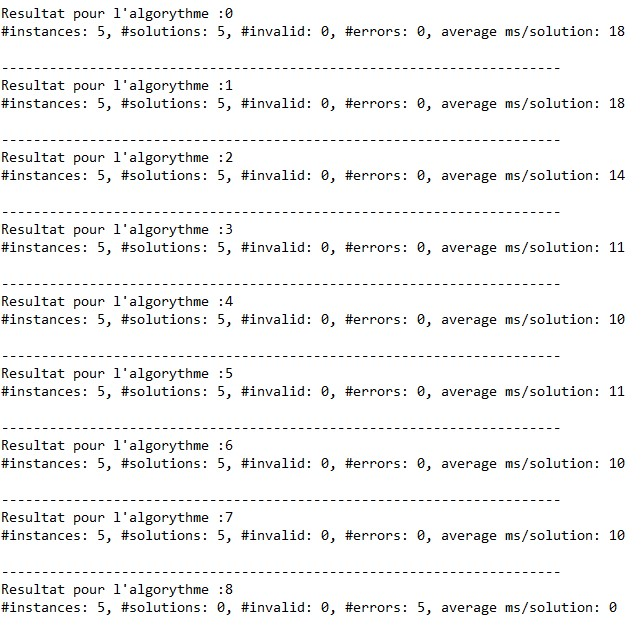
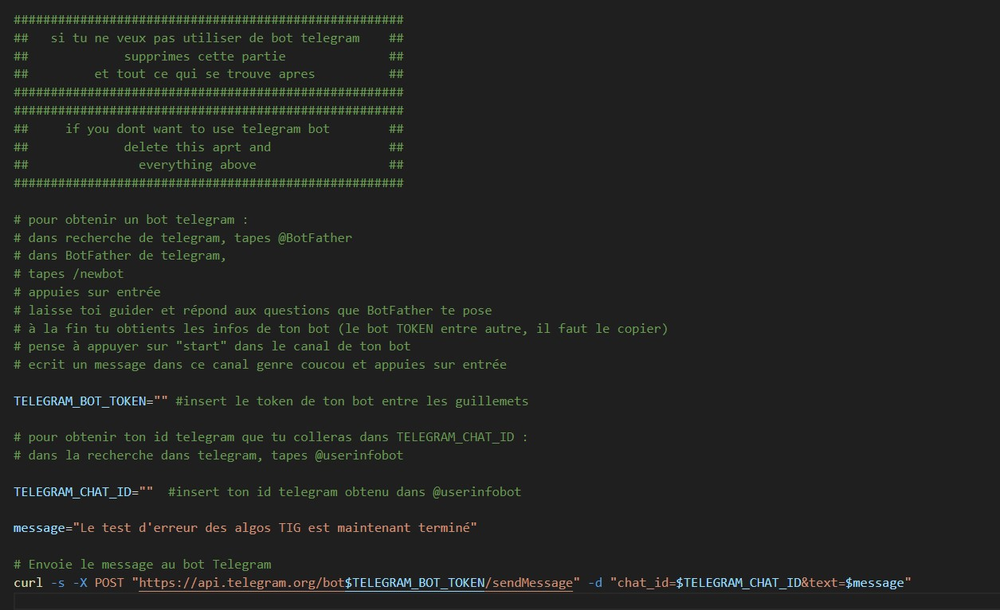

# tig-tester
algorithms tester for TIG blockchain 
<H1>TIG TESTER FOR LINUX</H1><br/>
<h2>MIS A JOUR POUR LE ROUND 40</h2>


<table>
<tr>
<td>
<figure>

<figcaption>first_test.sh</figcaption>
</figure>
</td><td>
<figure>

<figcaption>algo_test_telegram.sh</figcaption>
</figure>
</td>
</tr>
</table>
<h2> 1 - FIRST_TEST.SH</h2><br/>
<p>
  Ce premier test sert à faire ressortir les algorithmes qui provoquent des erreurs dans le benchmarker de TIG en fonction de votre matériel. le script telechargera tous les algorithmes sur votre machine afin de les tester un par un.
</p><br/>
<H3>a) Installer le script</H3>

`cd /path/tig-monorepo`<br/><br/>
`wget https://raw.githubusercontent.com/joly534/tig-tester/main/first_test.sh`<br/><br/>
`chmod +x fisrt_test.sh`<br/><br/>

<h3>b)Associer votre bot Telegram (optionnel)</h3>

<p>Si vous voulez associer votre bot Telegram à ce script pour être avertit lorsque celui-ci se finit, entrez les infos nécessaires dans le code du script</p>

<p>Si vous ne souhaitez pas utiliser de bot telegram il vous suffit de supprimer la partie du code comme indiqué dans celui ci</p>
<figure>

<figcaption>image de l'endroit ou vous devez entrer ou supprimer les infos</figcaption>
</figure>

<h3>c)Lancer le script</h3>

`./first_test.sh`<br/><br/>

<h3>d)Lire les résultats</h3>

`nano test_errors.txt`<br/><br/>

<h2> 2 - ALGO_TESTS</h2><br/>
<p>
  Ce test vient en complément du premier tester "first_test.sh".<br/>
  Il existe deux version de ce tester :

<p>
  la version avec export du resultat dans un fichier texte :<br/>

  ```wget https://raw.githubusercontent.com/joly534/tig-tester/main/algo_test.sh``` <br/>
    
  la version avec export du resultat dans un canal bot Telegram :

  ```wget https://raw.githubusercontent.com/joly534/tig-tester/main/algo_test_telegram.sh```<br/>

</p><br/>


