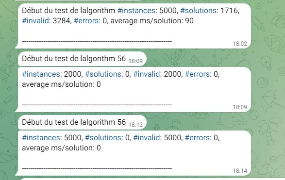

# tig-tester
algorithms tester for TIG blockchain 
<H1>TIG TESTER FOR LINUX</H1>

<h2> 1 - FIRST_TEST.SH</h2> 

  Ce premier test sert à faire ressortir les algorithmes qui provoquent des erreurs dans le benchmarker de TIG en fonction de votre matériel. 

 
<H3>a) Installer le script</H3>

`cd /path/tig-monorepo`  
`wget https://github.com/joly534/tig-tester/blob/main/first_test.sh`  
`chmod +x fisrt_test.sh`  

<h3>b)Lancer le script</h3>

`./first_test.sh`  

<h3>c)Lire les résultats</h3>

`nano test_errors.txt`  

<h2> 2 - ALGO_TESTS</h2> 

  Ce test vient en complément du premier tester "first_test.sh". 
  Il existe deux version de ce tester :
  <ul>
    <li>la version avec export du resultat dans un fichier texte : <a href="https://github.com/joly534/tig-tester/blob/main/algos_test.sh">algo_test.sh</a></li> 
    <li>la version avec export du resultat dans un canal bot Telegram : <a href="https://github.com/joly534/tig-tester/blob/main/algo_test_telegram.sh">algo_test_telegram.sh</a></li>  
    
  </ul>

